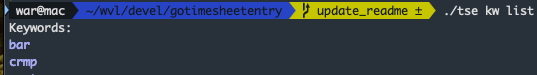

#  go timesheet entry cli - tse

Sister project of [Kiara automation](https://github.com/WilliamVannuffelen/kiara_automation).

CLI tool to generate timesheet entries in an excel file, sourcing from global or keyword-specific defaults to reduce human effort.

## Parameter input

There are three ways to pass values for the target timesheet entry:

- global defaults from the config file. default path: `./config/config.yaml`
- values sourced by keyword matching. default path `./keywords/keywords.json`
- commandline flags

These are overridden in reverse order. I.e. a commandline value will override a keyword value which will override a global default value.


## Example

```sh
# using a keyword to source values for recurring tasks:
tse add -k s -t 1.5

Added timesheet entry:
  "Day": Sat
  "Date": 2024-11-02
  "Description": standup
  "JiraRef": OPS-305
  "TimeSpent": 1.5
  "Project": CS0126444 - Project defined in keywords.json
  "AppRef":
```

## Results in an excel sheet ready for processing by [Kiara automation](https://github.com/WilliamVannuffelen/kiara_automation):

#### The week's sheet is created from a template if it doesn't exist yet


# Getting started

## 1. Edit config file

Default path is `./config/config.yaml`

Comments inside the config file explain the purpose of the various settings.

## 2. Add some keywords

Default path is `./keywords/keywords.json`.

Can be edited manually, or manipulated using `keyword` / `kw` subcommands:

```sh
# list existing keyword names:
tse kw list
```


```sh
# list existing keyword info:
tse kw list -A # top
# can also set output format to json for consumption with jq
tse kw list -A -o json # bottom
```


```sh
# add new kw, or update values of existing item
tse kw add -k newkw -d importanttask -p "CS10101010 - new project"
```


```sh
# show kw
tse kw show -k newkw
```


## 3. Add some timesheet entries

```sh

```


## 4. View existing timesheet entries

```sh
# show current week overview
tse show
```


```sh
# let's zoom in on this monday
tse show -D mon
```


```sh
# or a specific date
tse show -w -d 2024-09-30


```

## Help commands are available for every command and subcommand:
```sh
# running tse with no subcommands prints general help:
tse

# Time Sheet Entry is a CLI tool to manage time sheet entries.

# Usage:
#   tse [flags]
#   tse [command]

# Available Commands:
#   add-timesheet-entry Alias: add - Add timesheet entry
```

```sh
# each subcommand supports help and -h. e.g.:
tse help kw add
tse help add
tse add-timesheet-entry -h

# Adds a timesheet entry to the timesheet.

# Usage:
#   tse add-timesheet-entry [flags]

# Aliases:
#   add-timesheet-entry, add

# Flags:
#   -a, --app-ref string       App reference of the timesheet entry. Will default to the value set in config.yaml
#   -D, --date string          Date of the timesheet entry in yyyy-MM-dd format. Will default to today if not provided.
#   -d, --description string   Description of the timesheet entry
```


```sh
# provide all values as flags:
tse add --description "did some work" --timespent 1.5 --project "CS000001 - Some project" --jira-ref DEV-2021 --app-ref 60344 --date 2024-10-31
# or with short form flags:
tse add -d "did some work" -t 1.5 -p "CS000001 - Some project" -j DEV-2021 -a 60344 -d 2024-10-31

Added timesheet entry:
  "Day": Thu
  "Date": 2024-10-31
  "Description": did some work
  "JiraRef": DEV-2021
  "TimeSpent": 1.5
  "Project": CS000001 - Some project
  "AppRef": 60344
```

```sh
# relying on global defaults from config.yaml:
# sources JiraRef and Project from config.yaml
# doesn't source AppRef since the default is disabled in config.yaml
# defaults to datetime of today
tse add -d "did some work" -t 1.5

Added timesheet entry:
  "Day": Sat
  "Date": 2024-11-02
  "Description": did some work
  "JiraRef": DEV-2021
  "TimeSpent": 1.5
  "Project": CS000001 - Some project
  "AppRef":
```
